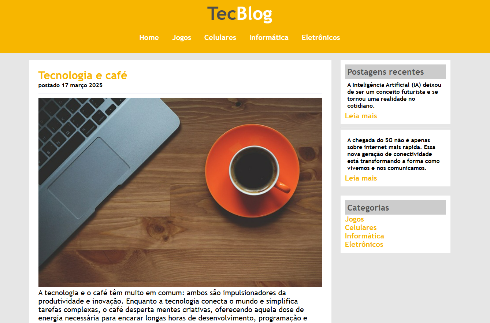

<<<<<<< HEAD
<h1 align="center"> TecBlog</h1>

Desenvolvido por Guilherme Hytalo a nível de estudo e desenvolvimento.

 

  

## 🚀 Tecnologias

Esse projeto foi desenvolvido com as seguintes tecnologias:

- HTML
- CSS
- Git e Github

## 💻 Projeto

Pagina com tecnologias HTML e CSS de um Blog ficticio. A nivel de desenvolvimento pessoal.

---

 Feito com ♥ por Guilherme Hytalo. 

=======
# TecBlog
Blog fictício para exercício de conhecimento
>>>>>>> 0c0a3043a76b6d7202d6862b9d2b71735b7b9e7c
